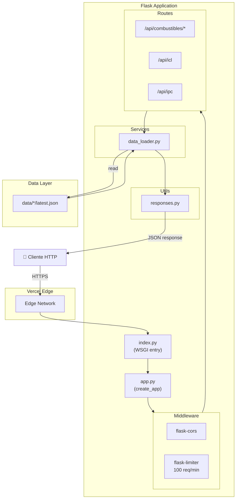
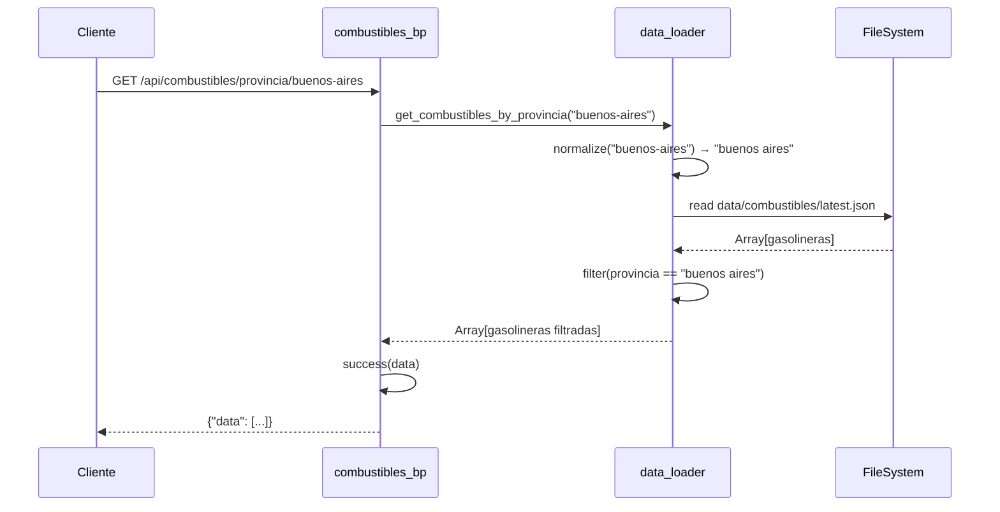
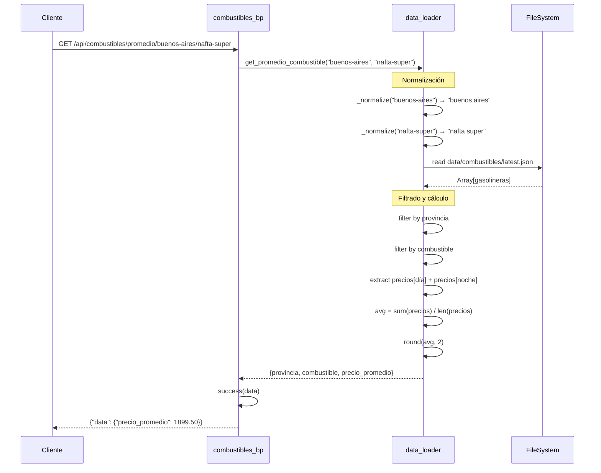
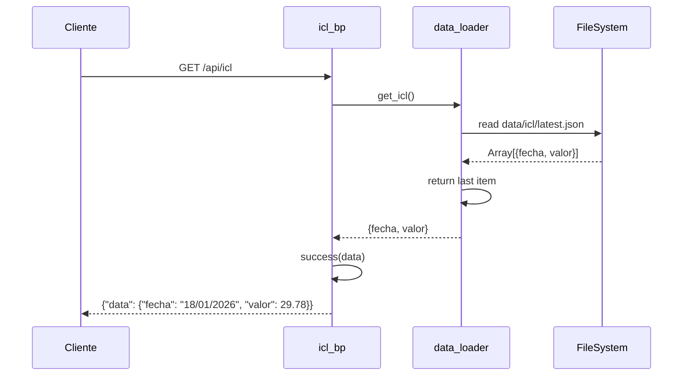
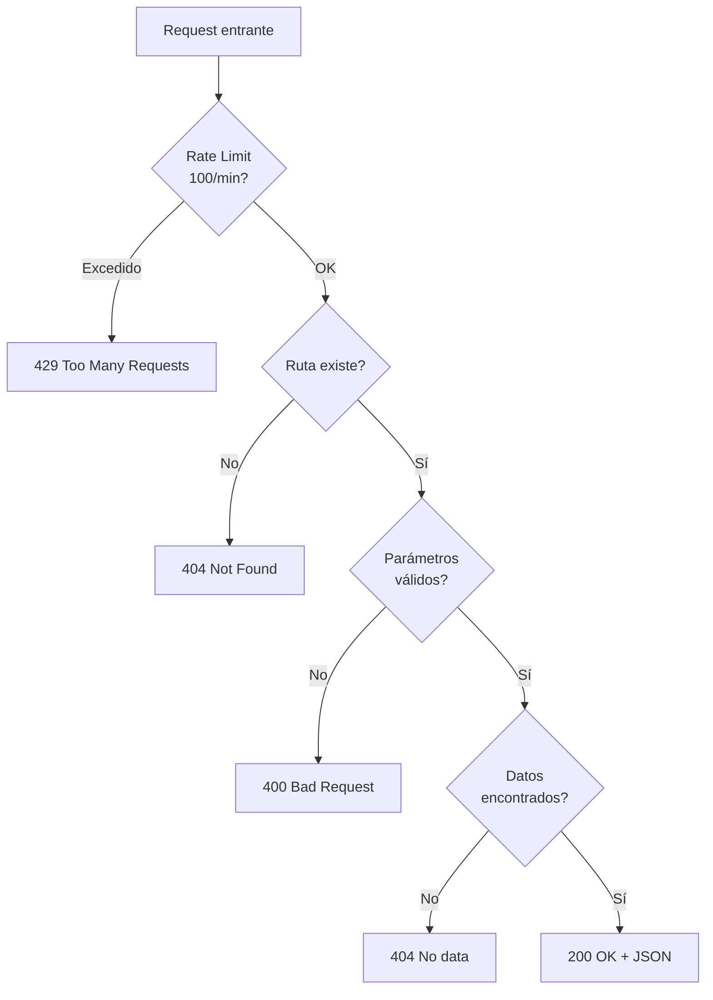

# Flujo de Requests API

Diagramas que muestran cómo se procesan las peticiones HTTP.

## Flujo General de Request

## Endpoint: Combustibles por Provincia

## Endpoint: Promedio de Combustible

Este es el endpoint más complejo, con normalización de texto.

## Endpoint: ICL

## Manejo de Errores

