# Flujo de Requests API

Diagramas que muestran cómo se procesan las peticiones HTTP.

## Flujo General de Request

```mermaid
flowchart TB
    CLIENT["👤 Cliente HTTP"]

    subgraph VERCEL["Vercel Edge"]
        EDGE["Edge Network"]
    end

    subgraph FLASK["Flask Application"]
        INDEX["index.py<br/>(WSGI entry)"]
        APP["app.py<br/>(create_app)"]

        subgraph MW["Middleware"]
            CORS["flask-cors"]
            LIMIT["flask-limiter<br/>100 req/min"]
        end

        subgraph ROUTES["Routes"]
            R1["/api/combustibles/*"]
            R2["/api/icl"]
            R3["/api/ipc"]
        end

        subgraph SERVICES["Services"]
            DL["data_loader.py"]
        end

        subgraph UTILS["Utils"]
            RESP["responses.py"]
        end
    end

    subgraph DATA["Data Layer"]
        JSON["data/*/latest.json"]
    end

    CLIENT --> |HTTPS| EDGE
    EDGE --> INDEX
    INDEX --> APP
    APP --> MW
    MW --> ROUTES
    ROUTES --> DL
    DL --> |read| JSON
    JSON --> DL
    DL --> RESP
    RESP --> |JSON response| CLIENT
```

## Endpoint: Combustibles por Provincia

## Endpoint: Promedio de Combustible

Este es el endpoint más complejo, con normalización de texto.

## Endpoint: ICL

## Manejo de Errores

```mermaid
flowchart TB
    REQ["Request entrante"]

    REQ --> LIMIT{Rate Limit<br/>100/min?}
    LIMIT --> |Excedido| E429["429 Too Many Requests"]
    LIMIT --> |OK| ROUTE{Ruta existe?}

    ROUTE --> |No| E404["404 Not Found"]
    ROUTE --> |Sí| PARAM{Parámetros<br/>válidos?}

    PARAM --> |No| E400["400 Bad Request"]
    PARAM --> |Sí| DATA{Datos<br/>encontrados?}

    DATA --> |No| E404_2["404 No data"]
    DATA --> |Sí| SUCCESS["200 OK + JSON"]
```

