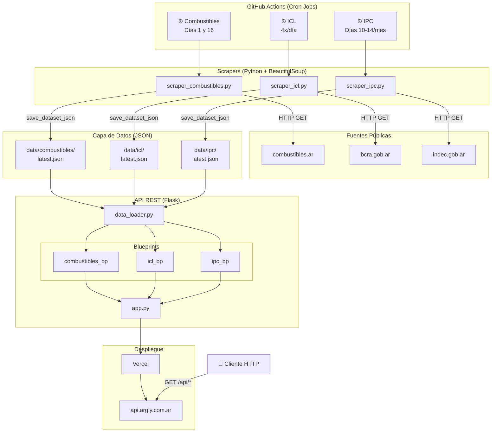

# Arquitectura General

Diagrama que muestra la arquitectura completa del sistema Argly.

## Componentes Principales

| Componente | Descripción |
|------------|-------------|
| **GitHub Actions** | Ejecuta scrapers automáticamente según cronograma |
| **Scrapers** | Recolectan datos de fuentes públicas argentinas |
| **Data Layer** | Almacena JSONs con datos históricos y vigentes |
| **Flask API** | Expone endpoints REST para consumo público |
| **Vercel** | Hosting serverless con deploy automático |
