# Pipeline CI/CD

Diagrama del flujo de integración y despliegue continuo.

```mermaid
flowchart LR
    subgraph TRIGGER["Trigger"]
        CRON["⏰ Cron Schedule"]
        MANUAL["🖱️ Manual Dispatch"]
    end

    subgraph GHA["GitHub Actions"]
        CHECKOUT["📥 Checkout código"]
        SETUP["🐍 Setup Python 3.12"]
        DEPS["📦 pip install"]
        SCRAPER["🕷️ Ejecutar scraper"]
        COMMIT["💾 Git commit"]
        PUSH["🚀 Git push"]
    end

    subgraph VERCEL["Vercel"]
        DETECT["🔍 Detectar cambios"]
        BUILD["🏗️ Build"]
        DEPLOY["🌐 Deploy"]
    end

    PROD["✅ api.argly.com.ar"]

    CRON --> CHECKOUT
    MANUAL --> CHECKOUT
    CHECKOUT --> SETUP
    SETUP --> DEPS
    DEPS --> SCRAPER
    SCRAPER --> |data/*.json| COMMIT
    COMMIT --> PUSH
    PUSH --> |webhook| DETECT
    DETECT --> BUILD
    BUILD --> DEPLOY
    DEPLOY --> PROD
```



## Workflows Configurados

### combustibles.yml
```yaml
schedule:
  - cron: '0 6 1,16 * *'  # Días 1 y 16 a las 06:00 UTC
```

### icl.yml
```yaml
schedule:
  - cron: '0 12,13,14,15 * * *'  # 12:00, 13:00, 14:00, 15:00 UTC
```

### ipc.yml
```yaml
schedule:
  - cron: '0 5 10-14 * *'  # Días 10-14 a las 05:00 UTC
```

## Flujo de Commit Automático

```mermaid
sequenceDiagram
    participant GHA as GitHub Actions
    participant Scraper
    participant Git
    participant Vercel

    GHA->>Scraper: Ejecutar script
    Scraper->>Scraper: Fetch datos públicos
    Scraper->>Scraper: Parse HTML
    Scraper->>Git: Guardar JSON en /data

    alt Hay cambios en data/
        Git->>Git: git add data/
        Git->>Git: git commit -m "chore: update {dataset}"
        Git->>Git: git push origin main
        Git-->>Vercel: Webhook trigger
        Vercel->>Vercel: Build & Deploy
    else Sin cambios
        Git-->>GHA: Skip commit
    end
```


