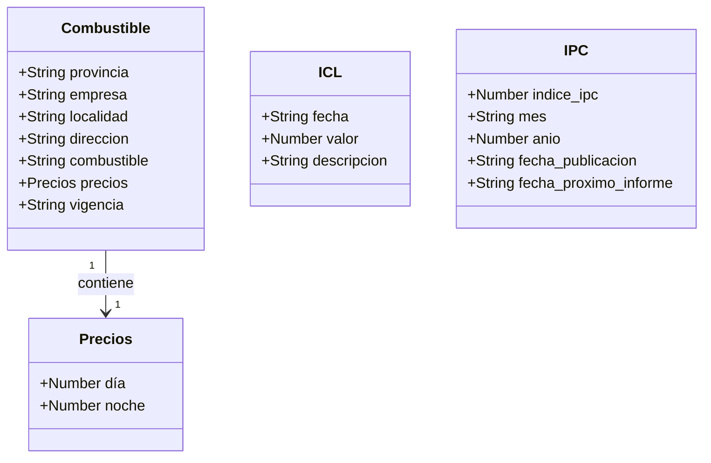
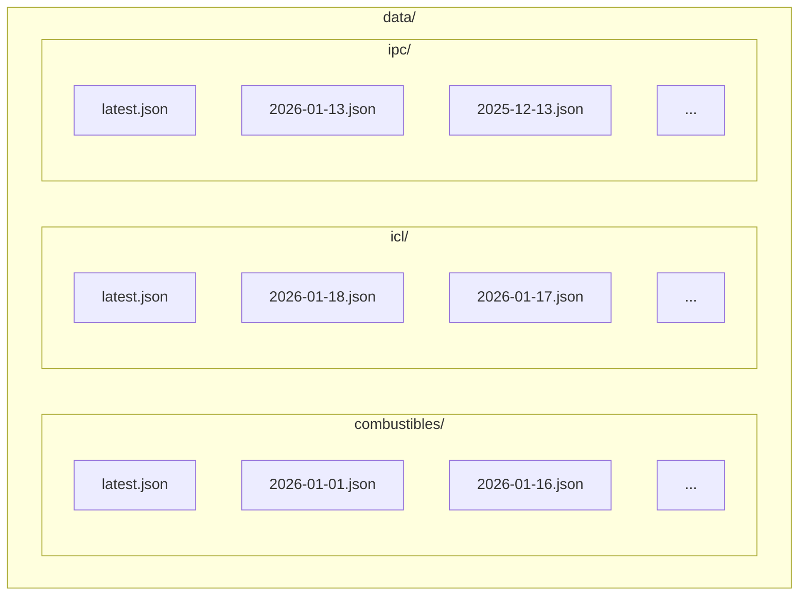
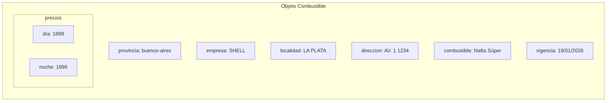
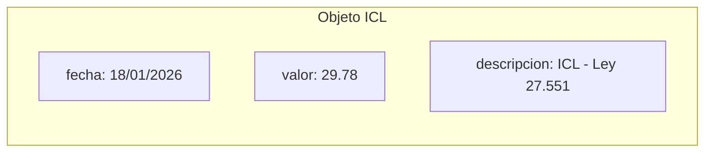
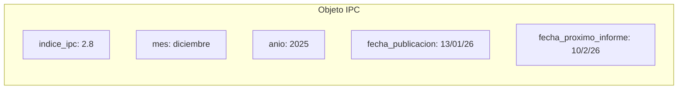
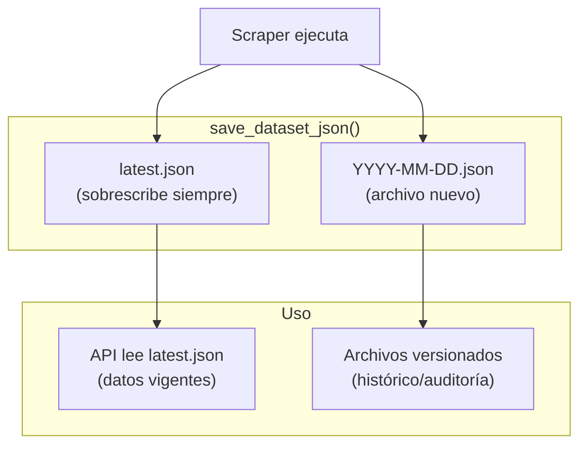
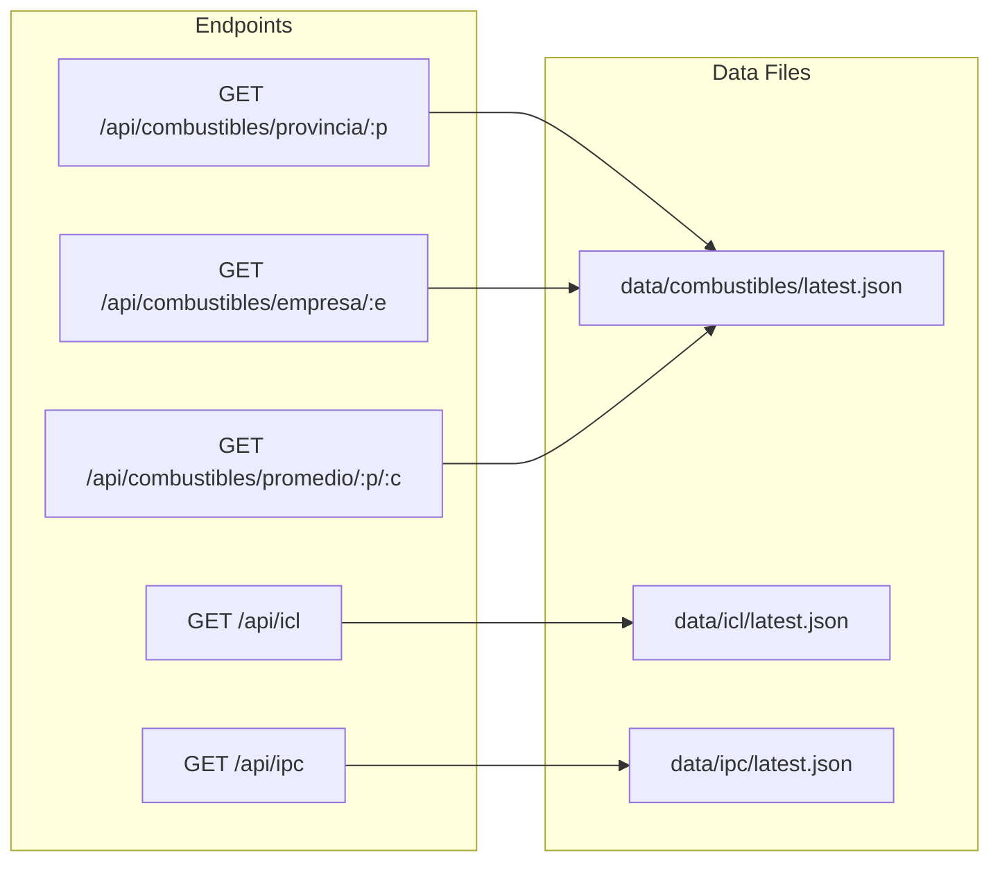

# Estructura de Datos

Diagramas que muestran la estructura de los datos JSON.

## Diagrama de Clases (Estructura JSON)



## Estructura de Archivos



## Ejemplo: Combustible

```json
{
  "provincia": "buenos-aires",
  "empresa": "SHELL",
  "localidad": "LA PLATA",
  "direccion": "AV. 1 1234",
  "combustible": "Nafta Súper",
  "precios": {
    "día": 1899,
    "noche": 1899
  },
  "vigencia": "19/01/2026"
}
```



## Ejemplo: ICL

```json
{
  "fecha": "18/01/2026",
  "valor": 29.78,
  "descripcion": "ICL - Ley 27.551"
}
```



## Ejemplo: IPC

```json
{
  "indice_ipc": 2.8,
  "mes": "diciembre",
  "anio": 2025,
  "fecha_publicacion": "13/01/26",
  "fecha_proximo_informe": "10/2/26"
}
```



## Flujo de Datos: latest.json vs Versionados



## Relación entre Endpoints y Datos


