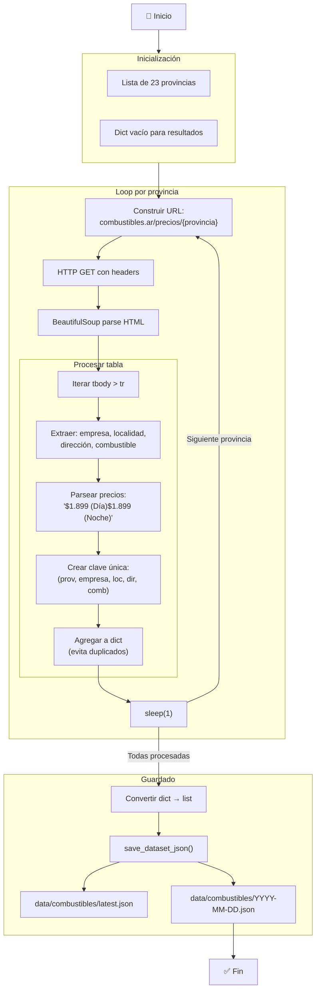
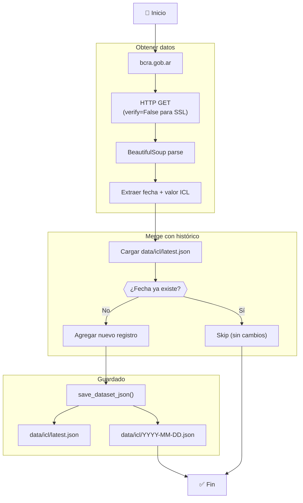
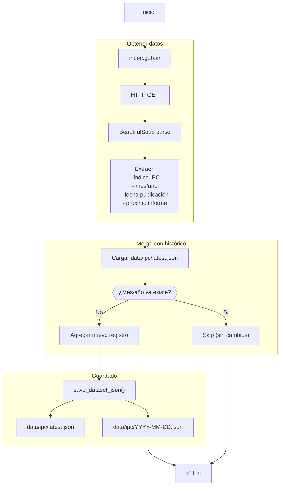
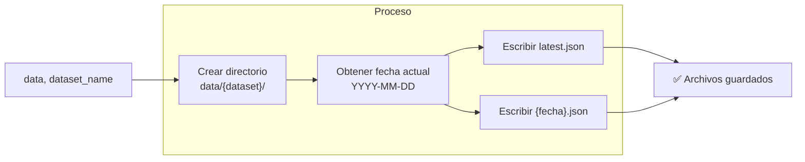

# Flujo de Scraping

Diagramas del proceso de recolección de datos desde fuentes públicas.

## Scraper de Combustibles

## Scraper de ICL (BCRA)

## Scraper de IPC (INDEC)

## Función save_dataset_json()

## Cronograma de Ejecución

```mermaid
gantt
    title Cronograma de Scrapers (Horario Argentina)
    dateFormat HH:mm
    axisFormat %H:%M

    section ICL
    Ejecución 1    :09:00, 30m
    Ejecución 2    :10:00, 30m
    Ejecución 3    :11:00, 30m
    Ejecución 4    :12:00, 30m

    section IPC
    Días 10-14/mes :02:00, 30m

    section Combustibles
    Días 1 y 16    :03:00, 30m
```

