# Flujo de Scraping

Diagramas del proceso de recolección de datos desde fuentes públicas.

## Scraper de Combustibles

```mermaid
flowchart TB
    START["🚀 Inicio"]

    subgraph INIT["Inicialización"]
        PROVS["Lista de 23 provincias"]
        DICT["Dict vacío para resultados"]
    end

    subgraph LOOP["Loop por provincia"]
        URL["Construir URL:<br/>combustibles.ar/precios/{provincia}"]
        FETCH["HTTP GET con headers"]
        PARSE["BeautifulSoup parse HTML"]

        subgraph TABLE["Procesar tabla"]
            ROWS["Iterar tbody > tr"]
            EXTRACT["Extraer: empresa, localidad,<br/>dirección, combustible"]
            PRICE["Parsear precios:<br/>'$1.899 (Día)$1.899 (Noche)'"]
            KEY["Crear clave única:<br/>(prov, empresa, loc, dir, comb)"]
            DEDUP["Agregar a dict<br/>(evita duplicados)"]
        end

        SLEEP["sleep(1)"]
    end

    subgraph SAVE["Guardado"]
        TOLIST["Convertir dict → list"]
        SAVEJSON["save_dataset_json()"]
        LATEST["data/combustibles/latest.json"]
        VERSION["data/combustibles/YYYY-MM-DD.json"]
    end

    END["✅ Fin"]

    START --> INIT
    INIT --> URL
    URL --> FETCH
    FETCH --> PARSE
    PARSE --> ROWS
    ROWS --> EXTRACT
    EXTRACT --> PRICE
    PRICE --> KEY
    KEY --> DEDUP
    DEDUP --> SLEEP
    SLEEP --> |Siguiente provincia| URL
    SLEEP --> |Todas procesadas| TOLIST
    TOLIST --> SAVEJSON
    SAVEJSON --> LATEST
    SAVEJSON --> VERSION
    VERSION --> END
```

## Scraper de ICL (BCRA)

```mermaid
flowchart TB
    START["🚀 Inicio"]

    subgraph FETCH["Obtener datos"]
        URL["bcra.gob.ar"]
        GET["HTTP GET<br/>(verify=False para SSL)"]
        PARSE["BeautifulSoup parse"]
        EXTRACT["Extraer fecha + valor ICL"]
    end

    subgraph MERGE["Merge con histórico"]
        LOAD["Cargar data/icl/latest.json"]
        CHECK{{"¿Fecha ya existe?"}}
        APPEND["Agregar nuevo registro"]
        SKIP["Skip (sin cambios)"]
    end

    subgraph SAVE["Guardado"]
        SAVEJSON["save_dataset_json()"]
        LATEST["data/icl/latest.json"]
        VERSION["data/icl/YYYY-MM-DD.json"]
    end

    END["✅ Fin"]

    START --> URL
    URL --> GET
    GET --> PARSE
    PARSE --> EXTRACT
    EXTRACT --> LOAD
    LOAD --> CHECK
    CHECK --> |No| APPEND
    CHECK --> |Sí| SKIP
    APPEND --> SAVEJSON
    SAVEJSON --> LATEST
    SAVEJSON --> VERSION
    VERSION --> END
    SKIP --> END
```

## Scraper de IPC (INDEC)

```mermaid
flowchart TB
    START["🚀 Inicio"]

    subgraph FETCH["Obtener datos"]
        URL["indec.gob.ar"]
        GET["HTTP GET"]
        PARSE["BeautifulSoup parse"]
        EXTRACT["Extraer:<br/>- índice IPC<br/>- mes/año<br/>- fecha publicación<br/>- próximo informe"]
    end

    subgraph MERGE["Merge con histórico"]
        LOAD["Cargar data/ipc/latest.json"]
        CHECK{{"¿Mes/año ya existe?"}}
        APPEND["Agregar nuevo registro"]
        SKIP["Skip (sin cambios)"]
    end

    subgraph SAVE["Guardado"]
        SAVEJSON["save_dataset_json()"]
        LATEST["data/ipc/latest.json"]
        VERSION["data/ipc/YYYY-MM-DD.json"]
    end

    END["✅ Fin"]

    START --> URL
    URL --> GET
    GET --> PARSE
    PARSE --> EXTRACT
    EXTRACT --> LOAD
    LOAD --> CHECK
    CHECK --> |No| APPEND
    CHECK --> |Sí| SKIP
    APPEND --> SAVEJSON
    SAVEJSON --> LATEST
    SAVEJSON --> VERSION
    VERSION --> END
    SKIP --> END
```

## Función save_dataset_json()

```mermaid
flowchart LR
    INPUT["data, dataset_name"]

    subgraph PROCESS["Proceso"]
        DIR["Crear directorio<br/>data/{dataset}/"]
        DATE["Obtener fecha actual<br/>YYYY-MM-DD"]
        WRITE1["Escribir latest.json"]
        WRITE2["Escribir {fecha}.json"]
    end

    OUTPUT["✅ Archivos guardados"]

    INPUT --> DIR
    DIR --> DATE
    DATE --> WRITE1
    DATE --> WRITE2
    WRITE1 --> OUTPUT
    WRITE2 --> OUTPUT
```

## Cronograma de Ejecución

